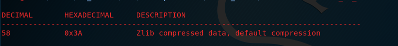
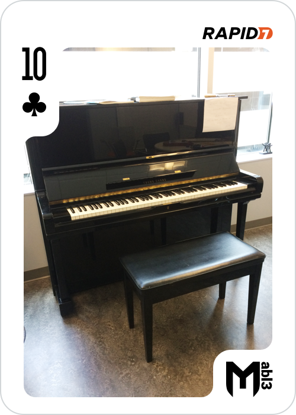

## 10 of Clubs

Inside the folder /artoo_detoo/music there is the 10_of_clubs.wav file, let's have a look at it!
Wait! we can't hear music, just noise and no hint after several analyses with Audacity. Our last resource is to perform a file analyse to find some hidden data. 
In that case binwalk can help us:

```
binwalk 10_of_clubs.wav
```


There is something inside the audio file, we can extract it using the -d flag

```
binwalk -d 10_of_clubs.wav
```

And here we go, another flag in our collection!




```
MD5 = 79c9107cf553b149a542501f5fb277d7 
```
