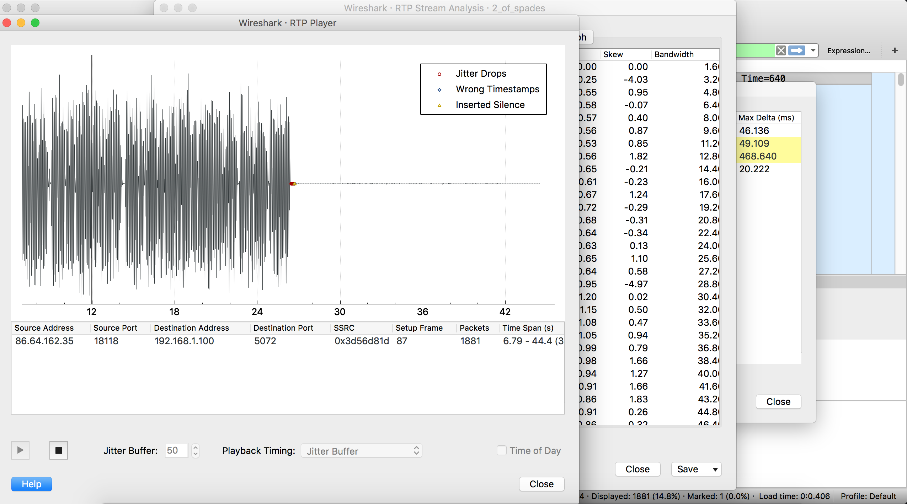

## 2 of Spades

The file 2_of_spades.pcapng is located in the Leia Organa's home folder.


```
root@ip-10-0-101-252:/home# ls -lah /home/leia_organa/
total 8.4M
drwxr-xr-x  2 leia_organa users 4.0K Nov  7 16:45 .
drwxr-xr-x 19 root        root  4.0K Dec  5 13:28 ..
-rw-------  1 leia_organa root  8.3M Nov  7 16:45 2_of_spades.pcapng
-rw-r--r--  1 leia_organa users  220 Apr  9  2014 .bash_logout
-rw-r--r--  1 leia_organa users 3.6K Apr  9  2014 .bashrc
-rw-r--r--  1 leia_organa users  675 Apr  9  2014 .profile
```

Analysing the captured packets with Wireshark, turns out to be an audio stream over RTP protocol, 

From Wireshark we navigate to Telephony->RTP->RTP Streams



A voice is spelling a URL at the end of the stream

"http://imgur.com/gmThKFP".

We just have to put the in link in our browser to find another flag!!!


```
MD5  = 1e6f926e341b9daf32fe70171eb727b4
```