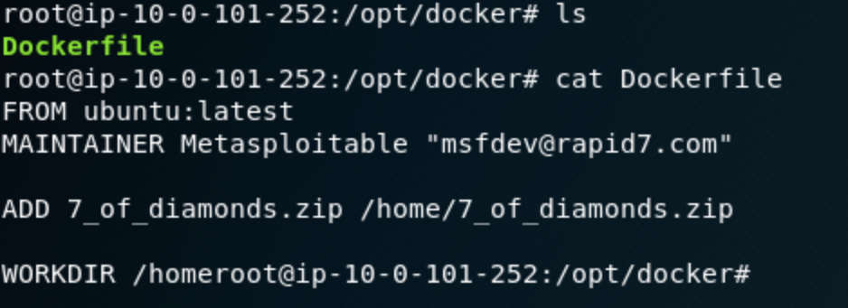
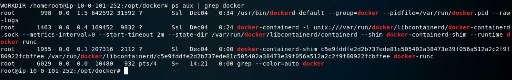
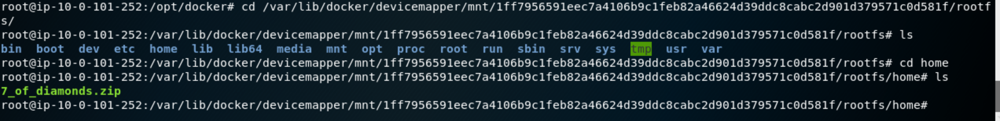
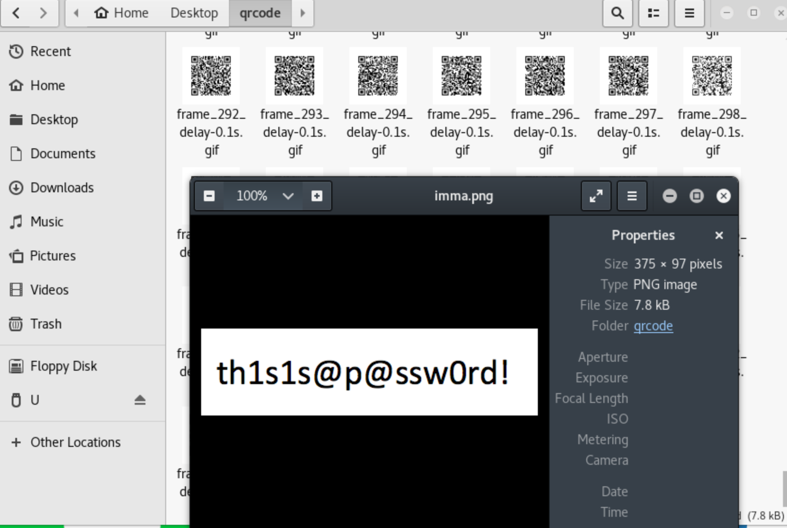
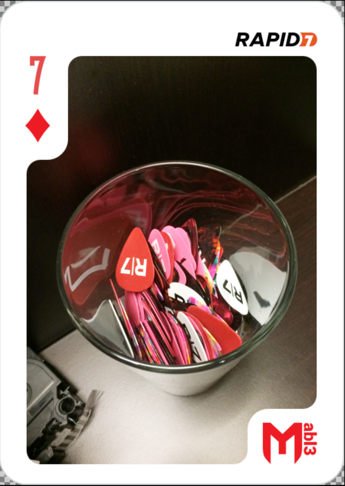

## 7 of Diamonds

In the directory /opt/docker there is "Dockerfile", which contains some docker command about a file named 7_of_diamonds.zip 
moved in the /home directory:



With the command "ps" we can find some information about the docker process:



After some enumeration we obtain some useful information:


And here we are, another zip to analyze: 7_of_diamonds.zip:



The content of the zip, is ... well, another password protected zip an dynamic qr codes gif. 
Using an online tool we can split the gif in all the frames.
Using a qrcode python lib, we are able to read all the qr code and append the values in the imma.png:
 

```
import qrtools
import binascii
qr = qrtools.QR()
b= ''
for x in range(0,314):
	if(len(str(x)) == 1):
		a = '00'+str(x)
	if(len(str(x)) ==  2):
		a = '0'+str(x)
	if(len(str(x)) == 3 ):
		a = str(x)
	#print a
	qr.decode("frame_"+a+"_delay-0.1s.gif")
	b+= binascii.unhexlify(qr.data)
f = open('imma.png','w')
f.write(b)
f.close()
```

This file is a png of the password for the zip:





`MD5 = 24aca233e12f3b24381357c43872aa6e`
