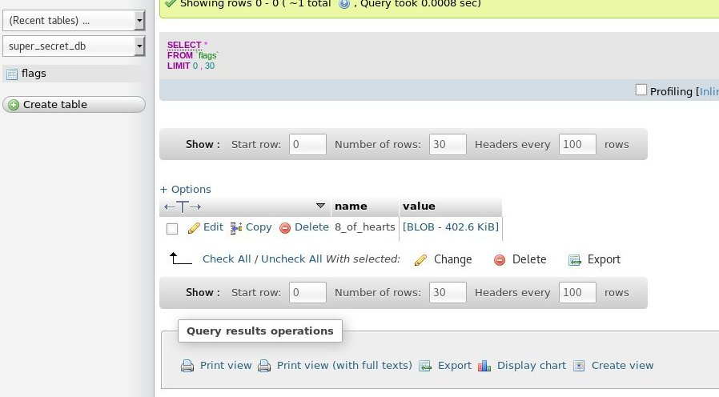
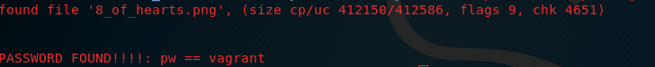

## 8 of Hearts

Once logged in the phpmyadmin, a curious "super_secret_db" have our attention, precisely a blob file inside the "flags" table




once downloaded the blob, we spot a zip file hidden inside it, unfortunately protected by a passsword.

we can try to crack it using a fcrack zip and a good dictonary like rockyou.txt

```
fcrackzip -v -D -u -p rockyou.txt 8_of_hearts.zip
```
After some second we have good news! Password found




```
e8e2f19dad5fc32f022952690d5beee6  img3.png

```
