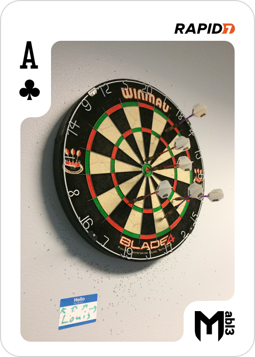

## Ace of Clubs

Let's analyze chatbot application on the Apache web server, it seems that  something interesting is hidden in the code:

```
root@ip-10-0-101-252:/opt/chatbot/papa_smurf# cat chat_client.js | grep flag | more
var flag = "iVBORw0KGgoAAAANSUhEUgAAAfQAAAK8CAYAAAAZNU0WAAAAAXNSR0IArs4c6QAAQABJREFUeAHsvQnUbVdV57vP194mNw2JEJoAgpDQRBpFFBERsOVRopRDLLVKh0PFoeizAZvxHMO+dFhaz74blj...
```

By decoding the base64, what we have is another flag:



`MD5 = 7aa0260989946155c0c6178ffc9b25e9`
