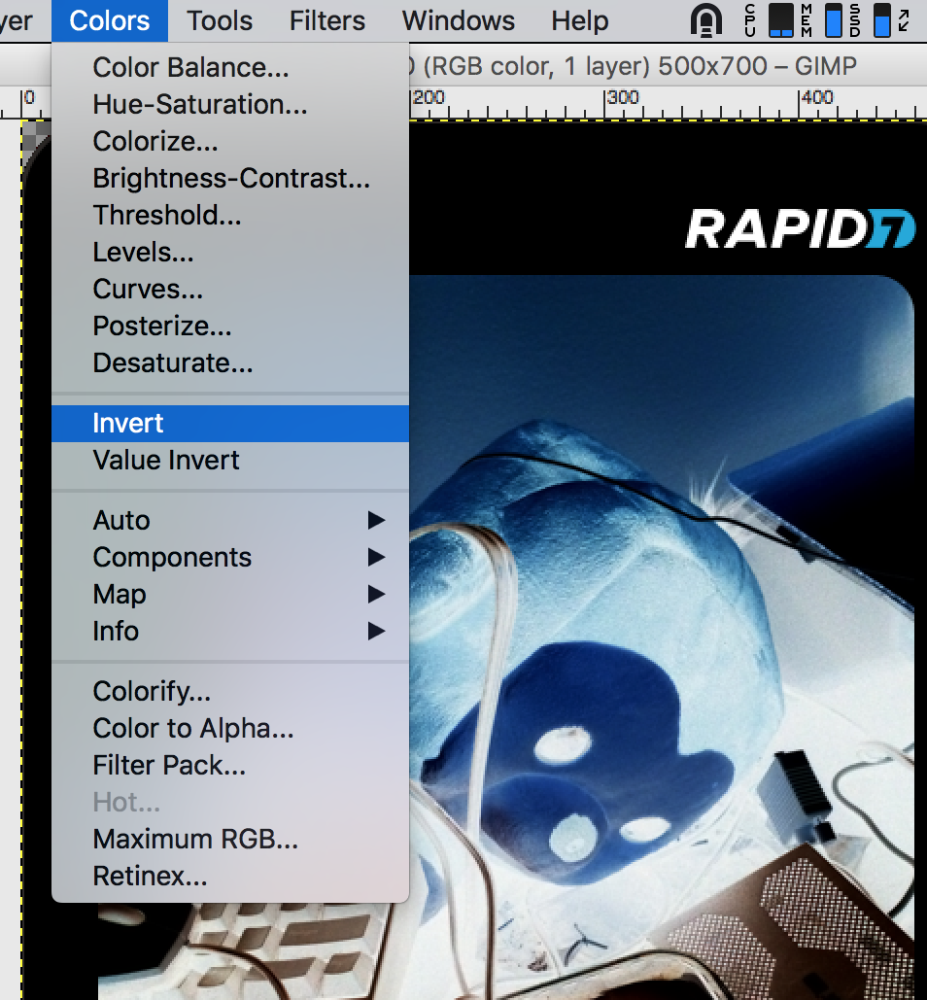
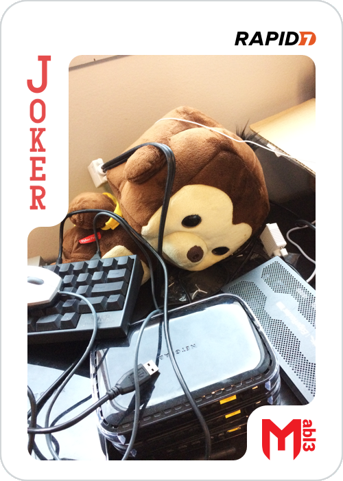

## Joker

With a simple command we find the joker flag:

```
root@ip-10-0-101-252:~# find / -name 'joker.png'
/etc/joker.png
```


Hey, something is wrong here, it seems that colors are messed up, let's invert them with GIMP




Then we can save it without any flags in order to not add metadata:


We get it:



`MD5 = 69ac2a39f42e91896b19a123e5e4d2a9`