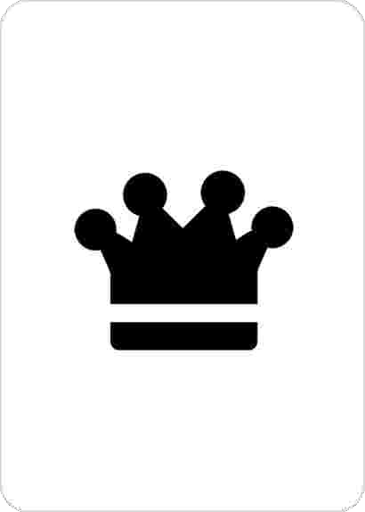
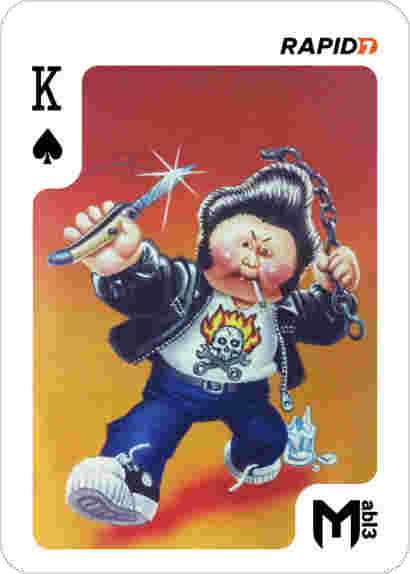

## King of Spades

The  /opt/unrealircd/Unreal3.2 seems to be a irc server.

Inside the ircd.motd file there is a base64 string, let's analyze it.

```
root@ip-10-0-101-252:/opt/unrealircd/Unreal3.2# more ircd.motd 
iVBORw0KGgoAAAANSUhEUgAAAZoAAAI+CAQAAAAvagSNAAAon0lEQVR42u2dd5ycVdm/n+09W7LZJEsNBCkBBIKIKD96EymKCKKICkrxh4i8ivAiggqIDRSVohiKvCBF4DUgNYEAoaWQ3pPNbjbZvrNTd9pe7x9z8m
R2Mrs7mXkmZGe/1/35mAQJMztzruecc59z7mNZO8AslrIyIeYrFKMoEtvvataxillY2eBxPqAVD...
```

We have this png:



This image is not the correct ones, so let's see if binwalk can give us some hint:

```
Stone:Flags syrion$ binwalk img_flag.png 

DECIMAL       HEXADECIMAL     DESCRIPTION
--------------------------------------------------------------------------------
0             0x0             PNG image, 410 x 574, 8-bit gray+alpha, non-interlaced
41            0x29            Zlib compressed data, best compression
10456         0x28D8          Zip archive data, at least v2.0 to extract, compressed size: 139943, uncompressed size: 140224, name: king_of_spades.png
150511        0x24BEF         End of Zip archive

Stone:Flags syrion$ binwalk -e img_flag.png 

DECIMAL       HEXADECIMAL     DESCRIPTION
--------------------------------------------------------------------------------
0             0x0             PNG image, 410 x 574, 8-bit gray+alpha, non-interlaced
41            0x29            Zlib compressed data, best compression
10456         0x28D8          Zip archive data, at least v2.0 to extract, compressed size: 139943, uncompressed size: 140224, name: king_of_spades.png
150511        0x24BEF         End of Zip archive

Stone:Flags syrion$ cd _img_flag.png.extracted/
Stone:_img_flag.png.extracted syrion$ ls
28D8.zip		29			29.zlib			king_of_spades.png
```



`MD5 = 8fc453ee48180b958f98e0d2d856d1c8`