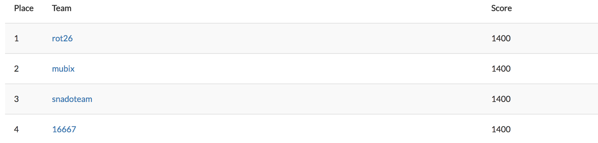

# Metasploitable-3-CTF
[Metasploitable3 CTF](https://metasploitable3ctf.com) Write-ups

* [Introduction](https://github.com/16667/Metasploitable-3-CTF/blob/master/Introduction/Introduction.md)
* [Joker](https://github.com/16667/Metasploitable-3-CTF/blob/master/Joker/joker.md)
* [Ace of Clubs](https://github.com/16667/Metasploitable-3-CTF/blob/master/Ace_of_Clubs/Ace_of_Clubs.md)
* [2 of Spades](https://github.com/16667/Metasploitable-3-CTF/blob/master/2_of_Spades/2_of_Spades.md)
* [3 of Hearts](https://github.com/16667/Metasploitable-3-CTF/blob/master/3_of_Hearts/3_of_Hearts.md)
* [5 of Diamonds](https://github.com/16667/Metasploitable-3-CTF/blob/master/5_of_Diamonds/5_of_Diamonds.md)
* [5 of Hearts](https://github.com/16667/Metasploitable-3-CTF/blob/master/5_of_Hearts/5_of_Hearts.md)
* [6 of Clubs](https://github.com/16667/Metasploitable-3-CTF/blob/master/6_of_Clubs/6_of_Clubs.md)
* [7 of Diamonds](https://github.com/16667/Metasploitable-3-CTF/blob/master/7_of_Diamonds/7_of_Diamonds.md)
* [8 of Clubs](https://github.com/16667/Metasploitable-3-CTF/blob/master/8_of_Clubs/8_of_Clubs.md)
* [8 of Hearts](https://github.com/16667/Metasploitable-3-CTF/blob/master/8_of_Hearts/8_of_Hearts.md)
* [9 of Diamonds](https://github.com/16667/Metasploitable-3-CTF/blob/master/9_of_Diamonds/9_of_Diamonds.md)
* [10 of Clubs](https://github.com/16667/Metasploitable-3-CTF/blob/master/10_of_Clubs/10_of_Clubs.md)
* [10 of Spades](https://github.com/16667/Metasploitable-3-CTF/blob/master/10_of_Spades/10_of_Spades.md)
* [King of Spades](https://github.com/16667/Metasploitable-3-CTF/blob/master/King_of_Spades/King_of_Spades.md)

